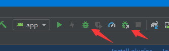

# android使用API对app进行调试

## android studio直接调试
很多情况下，我们调试app的时候，都是通过android studio的Debug app或者Attach Debugger to Android Process进行调试。

但是这两种调试方式是有缺点的，
Debug app是以调试模式安装app，安装完成之后会以正常流程运行，只不过这个时候调试器是打开的，并且app是可以调试的
如果在某处打了断点，这个时候app就会按顺序停留在断点处。可是如果我们的app很大，跑一次需要十几分钟，那么调试一次
需要的时间就有点长了，效率是比较低的。

Attach Debugger to Android Process可以在app已经运行的时候，将调试器直接附加在当前app的进程中，这种不需要每次
重新下载安装app，只需要在app启动的时候启动调试器并附加到app上，时间相对节约了很多，效率也比较高。但是如果需要调试
初始化的一些代码，比如说最开始activity的onCreate，是不好操作的，因为app启动完成点击这个按钮的时候，一些初始化代码
早已经执行完成了。

## 使用android.os.Debug
这个时候可以使用android系统提供的调试API方法：
Debug.waitForDebugger();
它的作用是等待调试器连接，当调试器连接上之后才会执行以后的代码。这个时候点击android studio的
Attach Debugger to Android Process按钮，当连接上调试器的时候，程序会继续执行waitForDebugger()之后的代码，
这样就可以调试一些启动靠前的代码，效率也节省很多。
可以添加标志判断是调试模式才调用这句代码，这样就不用每次发release包都修改，保证release不调用就ok了。

## license

    Copyright 2019 wjianchen13

    Licensed under the Apache License, Version 2.0 (the "License");
    you may not use this file except in compliance with the License.
    You may obtain a copy of the License at

       http://www.apache.org/licenses/LICENSE-2.0

    Unless required by applicable law or agreed to in writing, software
    distributed under the License is distributed on an "AS IS" BASIS,
    WITHOUT WARRANTIES OR CONDITIONS OF ANY KIND, either express or implied.
    See the License for the specific language governing permissions and
    limitations under the License.
